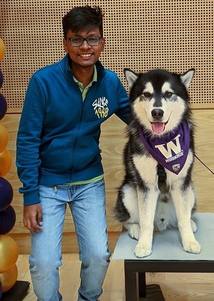

# Pranav S. Murali

Hi class! Welcome to my personal page.

## About Me

I'm a first year master's student specializing in Computer Architecture. I completed my bachelor's from a university in India in 2020. I moved to USA in September 2022. I haven't explored Seattle much and would gladly visit places or try things you could suggest. I am advised by Prof. Scott Hauck. Last quarter, I was the Teaching Assistant for EE 475/542 class taught by Prof. Shwetak Patel.

Connect with me on [LinkedIn](https://www.linkedin.com/in/pranavsrini) :smile:

## Electronics Experience

- During undergrad, I was with a team called Beeclust Multi-Robot Systems Lab. I was part of two major research projects and represented the team in various competitions :hammer:

- The best competition I participated in was the Mathworks Minidrone Competition at IEEE IROS 2019. My team finished runner-up. We also got the chance to explore Macau in China after the conference which was super fun :city_sunset:

- In 2020, I interned with the Robot Operating System Toolbox team in Mathworks :computer:

- After graduation, I worked independently as a consultant to three startups while trying to launch a startup of my own. My startup was unsuccesful :disappointed:. I designed about 15 different PCB's for one of the startups :hammer:

- One year later, I joined a company called Maxwell Energy Systems(ION Energy then) as an Application Engineer for Battery Management Systems designed by the company. I worked closely with three customers each building Electric Cranes, Electric Motorcycles and Autonomous Robots respectively :zap:

- Currently, I am working on FPGA Support for the Large Hadron Collider at CERN in Prof. Scott Hauck's lab :collision:

- I've also mentored students from different universities at various stages in the last two years. Do you have an idea that you don't know how to execute? I'm here! I'll be happy to help :metal:

## Hobbies

- I am a big fan of Cricket, a sport very popular in the Indian subcontinent. It's similar to baseball but can get really confusing with the rules :dizzy_face:

- I follow interesting events happening around Startups and Business :chart_with_upwards_trend:

- I also used to watch a lot of movies. I've watched most of IMDB's top rated movies. I don't watch TV shows :thumbsdown:

- I enjoy reading History :books:
